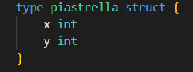

# GALLIANO ANDREA 05460A - RELAZIONE PROGETTO DI LABORATORIO DI ALGORITMI E STRUTTURE DATI

### Indice
- [Scelte di progettazione ed implementazione](#scelte-di-progettazione-ed-implementazione)
- [Strutture utilizzate](#strutture-utilizzate)

## Scelte di progettazione ed implementazione
Per poter affrontare ragionevolmente il problmema, sono state utilizzate apposite strutture che risolvessero tutti i punti richiesti e che rappresentassero fedelmente il piano descritto all'interno della traccia.  

### Strutture utilizzate
Per prima cosa, è necessario utilizzare una struttura che indichi le coordinate **_(x, y)_** di una **_Piastrella_**:  

