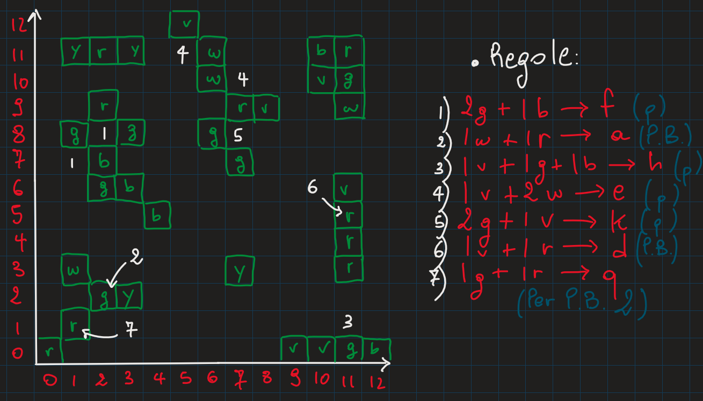

# GALLIANO ANDREA 05460A - RELAZIONE PROGETTO DI LABORATORIO DI ALGORITMI E STRUTTURE DATI

### Indice
- [Introduzione](#introduzione)
- [Strutture utilizzate](#strutture-utilizzate)  
    - [Piano](#il-piano)
    - [Piastrelle](#le-piastrelle)
    - [Colorazione](#la-colorazione)
    - [Regole di propagazione](#le-regole)  
- [Le funzioni principali](#le-funzioni-principali)
    - [Colora](#colora)
    - [Spegni](#spegni)
    - [Regola](#regola)
    - [Stato](#stato)
    - [Stampa](#stampa)
    - [Blocco](#blocco)
    - [Blocco Omogeneo](#blocco-omogeneo)
    - [Propaga](#propaga)
    - [Propaga Blocco](#propaga-blocco)
    - [Ordina](#ordina)
- [Esempi di esecuzione](#esempi-di-esecuzione)
    - [Esempio piano 1](#esempio-piano-1)
    - [Esempio piano 2](#esempio-piano-2)
    - [Esempio piano 3](#esempio-piano-3)
    - [Esempi lunghi](#esempi-lunghi)


## Introduzione
Per poter affrontare ragionevolmente il problmema, sono state utilizzate apposite strutture che risolvessero tutti i punti richiesti e che rappresentassero fedelmente il piano descritto all'interno della traccia.  

### Strutture utilizzate

#### Il piano

Per poter rappresentare fedelmente il **piano** contenente le **piastrelle** a cui poter applicare le **regole di propagazione**, è stato necessario utilizzare una struttura che, prima di tutto, avesse un campo che mettesse in relazione le coordinate **_(x, y)_** di una piastrella e i dati relativi all'*intensità con cui è accesa* ed il *colore*.  
Per questo motivo, il primo campo del **piano** è il *puntatore all'indirizzo di memoria di una mappa dalla piastrella alla corrispondente colorazione*.  
Il secondo campo della struttura è invece il *puntatore all'indirizzo di una slice di regole*, che torna utile nel momento in cui si decide di applicare una **regola di propagazione** a una o più piastrelle.

```Go
type piano struct {
    piastrelle *map[piastrella]colorazione
    regole     *[]regolaSingola
}
```

#### Le piastrelle
Le **piastrelle** sono state pensate come una struttura i cui campi sono 2 interi rappresentati le coordinate **(x, y)** della stessa all'interno del piano.  

```Go
type piastrella struct {
    x int
    y int
}
```

#### La colorazione
Come abbiamo visto per la prima struttura, per ogni **piastrella** accesa facente parte del **piano**, è necessario avere a disposizione altri 2 dati oltre le sue coordinate: l'*intensità* con cui è accesa nel **piano** ed il *colore*.  

```Go
type colorazione struct {
    coefficiente int
    colore       string
}
```

#### Le regole
Le **regole di propagazione** da poter applicare alle **piastrelle accese** nel **piano**, necessitano di 3 campi per poter essere rappresentate con una struttura: gli *addendi* che formano la regola, il *colore* che assume la **piastrella** dopo l'applicazione della regola ed il *consumo* (ovvero il numero di volte che la regola è stata applicata; questo campo permette di **ordinare** le regole in maniera **non decrescente**).  

```Go
type regolaSingola struct {
    addendi      []colorazione
    coloreFinale string
    consumo      int
}
```

### Le funzioni principali
Le funzioni implementate all'interno del programma, a fronte di un apposito input con i giusti comandi, permettono di modificare il piano e prestando particolare attenzioni all'uso delle risorse sia spaziali che temporali.  

#### Colora

```Go
func colora(p piano, x int, y int, alpha string, i int) {
    // implementazione di "colora"
}
```

La funzione **_colora_** riceve come parametri il **piano**, le coordinate intere **x** e **y**, il **colore** e l'**intensità** con cui si intende colorare la *piastrella*.  
Per effettuare l'operazione di *colorazione*, viene assegnata alla mappa contenente le *piastrelle* nel **piano** il valore della corrispondente **colorazione**.  
- **Analisi del tempo**: l'accesso alla mappa ha costo **_O(1)_** in termini di tempo. 
- **Analisi dello spazio**: non viene allocato alcuno spazio, di conseguenza il costo in termini di spazio è costante e nell'ordine di **_O(1)_**.

#### Spegni

```Go
func spegni(p piano, x int, y int) {
    // implementazione di "spegni"
}
```

La funzione **_spegni_** permette di spegnere una piastrella che, al momento, si trova (accesa) all'interno del **piano** con intensità ≥ 1.  
Per eseguire da codice questa operazione, ciò che viene fatto è un'*eliminazione della piastrella avuta per argomento tramite coordinate*.  
- **Analisi del tempo**: Anche l'operazione di *delete* dalla mappa impiega tempo costante, di conseguenza la complessità temporale è nell'ordine di **_O(1)_**.  
- **Analisi dello spazio**: Come per la complessità temporale, anche l'uso dello spazio è costante: **_O(1)_**.  

#### Regola

```Go
func regola(p piano, r string) {
    // implementazione di "regola"
}
```

La funzione **_regola_** permette, dati in ingresso il **piano** ed una **stringa**, di aggiungere una nuova regola all'interno del sistema.  
Per poterlo fare, è necessario, in primo luogo, effettuare un _parsing_ della stringa avuta per argomento, successivamente creare la regola (composta dai suoi 3 campi analizzati in precedenza) e, infine, *aggiungere la regola appena creata alla slice di regole facenti già parti del piano*.  
- **Analisi del tempo**: Per l'analisi temporale della funzione è necessario tenere conto di 2 macro-operazioni (le restanti operazioni possiamo ipotizzare abbiano tutte tempo costante **_O(1)_**):
1. L'esecuzione della funzione **_Split_**: complessità **_O(n)_**, dove **_n = numero di caratteri della stringa avuta per argomento_**;  
2. L'iterazione del ciclo che scorre la *slice* di stringhe che ritorna la stessa funzione **_Split_** (ovvero la variabile *args*): **_O(m)_**, con **_m = numero di elementi di args_**;  

Concludendo, possiamo dire che la complessità in termini di tempo è pari a **_O(n) + O(m) = O(n)_**, poiché **_m ≤ n_**.  
- **Analisi dello spazio**: Per l'analisi dello spazio occupato dalla funzione, partiamo con le variabili **_"nuovaRegola"_** ed **_"addendoRegola"_**, che occupano spazio **_O(1)_**; la *slice* **_addendi_**, invece, cresce nell'ordine di **_O(8)_** (non posso **MAI** avere più di 8 addendi per ogni regola), mentre l'aggiunta della nuova regola alla lista di regole del **piano** possiamo ipotizzare sia anch'essa **_O(1)_**. L'operazione più onerosa è dunque collegata alla chiamata della **_Split_**, che *crea una nuova slice di stringhe* in base alla lunghezza **_n_** di **_s_** (stringa passata per argomento): complessità pari a **_O(n)_**.  
Conclusione: la complessità in termini di spazio è nell'ordine di **_O(n)_**.

#### Stato

```Go
func stato(p piano, x int, y int) (string, int) {
    // implementazione di "stato"
}
```
La funzione **stato** *restituisce e stampa i valori relativi al colore e l'intensità della piastrella delle coordinate avute per argomento*.  
Per farlo, assegno ad una variabile il valore della mappa contenente le piastrelle del piano e un'altra, di tipo *bool*, per stampare (e, conseguentemente, anche ritornare) **se e solo se quella piastrella esiste nel piano**.  
- **Analisi del tempo**: Dal punto di vista del tempo, questa funzione è nell'ordine di **_O(1)_**, poiché tutte le operazioni che effettua (ovvero la restituzione di un valore della *mappa di piastrelle*, di un valore *bool* che indichi se quel valore esiste, il controllo prima della stmpa e il ritorno finale di **colore** e **intensità** della piastrella) impiegano tempo costante.  
- **Analisi dello spazio**: Anche lo spazio allocato, a livello di variabili dichiarate e memoria utilizzata, da parte di **stato** è nell'ordine di **_O(1)_**.


#### Stampa

```Go
func stampa(p piano) {
    // implementazione di "stampa"
}
```

La funzione **stampa** mostra tutte le **regole** del **piano** nel seguente formato:  
(    
*coloreFinale 1: coefficiente1 colore1 coefficiente2 colore2 ...*  
*coloreFinale 2: coefficiente1 colore1 coefficiente2 colore2 ...*  
.  
.  
.  
*coloreFinale n: coefficiente1 colore1 coefficiente2 colore2 ...*  
)  
Ciò che fa la funzione, a livello di codice, è *scorrere la slice di regole del **piano** e, per ognuna di essere scorrere gli addendi che la compongono stampando infine il coefficiente ed il colore dell'addendo* (separando opportunamente entrambi con uno spazio).

- **Analisi del tempo**: Questa funzione contiene 2 cicli: il primo scorre le **regole** nel **piano**, mentre il secondo scorre gli **addendi** di ogni regola. Il primo ciclo ha complessità **_O(n)_** (con *n = numero di regole nel piano*) ed il secondo effettua sempre, al più, 8 iterazioni (questo perché, per definizione del piano e dell'intorno di ogni piastrella con *max piastrelle circonvicine = 8*, **una regola di propagazione non può avere più di 8 addendi**).  
Di conseguenza, la complessità temporale totale della funzione **stampa** è pari a **_O(n) x O(8)_ = O(n)**.  
- **Analisi dello spazio**: La complessità spaziale di questa funzione di stampa è **_O(1)_**.  


#### Blocco

```Go
func blocco(p piano, x, y int) {
    // implementazione di "blocco"
}
```

La funzione **blocco** stampa la somma delle intensità delle piastrelle facenti parte del medesimo blocco; per poterlo fare con complessità spaziali e temporali contenute, è stato necessario partire dalle coordinate **_(x, y)_** di una piastrella avuta per argomento per poi _effettuare una **visita in ampiezza ("Breadth-First-Search")** ed avere a disposizione le piastrelle circonvicine del blocco_.  

La ricerca degli adiacenti o delle piastrelle circonvicine ad un'altra, le cui coordinate **_(x, y)_** sono passate per argomento ad un'apposita funzione **_"cercaAdiacenti"_**, non fa altro che _scorrere tutte le possibili **8 combinazioni** di coordinate di piastrelle circonvicine per poi restituirle all'interno di una slice di piastrelle_.

```Go
func cercaAdiacenti(p piano, piastrella_ piastrella) []piastrella {
    // le 8 combinazioni possibili per ogni piastrella:
    combX := []int{-1, 0, 0, 1, -1, -1, 1, 1}
    combY := []int{-1, -1, 1, -1, 1, 0, 0, 1}

    // implementazione di "cercaAdiacenti"
}
```

Per effettuare la *visita in ampiezza*, è stata inoltre utilizzata una **coda**, in cui vengono salvate temporaneamente le piastrelle visitate e dalle quali si andrà a visitarne le circonvicine.  
La struttura dati **coda**, con campi e funzioni scritte all'interno di un file a parte chiamato **_"queue.go"_**, è definita così:  

```Go
type queue struct {
	head *queueNode
	tail *queueNode
}

type queueNode struct {
	next  *queueNode
	value piastrella
}
```
La memorizzazione di **_tail_** è particolarmente utile all'interno della funzione di **_enqueue_**, poiché permette di _**NON** scorrere tutta la coda per aggiungere un elemento, ma di avere direttamente un puntatore all'ultimo nodo ed effettuare l'aggiunta risparmiando in termini di complessità temporale_.  

Verrà tenuto conto delle piastrelle già visitate salvandole permanentemente all'interno di una **mappa usata come _set_**.  
Dato che, però, all'interno del linguaggio **Go** _non esiste **"Set"** come vero e proprio tipo_, ecco come è stato realizzato:  

```Go
visitate := make(map[piastrella]struct{})
```

Questa mappa, **da piastrella a struct vuota**, permette di memorizzare solo le chiavi, in modo tale da trattare la struttura dati come un vero e proprio *set di piastrelle già visitate durante la BFS*.  
Viene utilizzata una *struct vuota* al posto di una *variabile di tipo bool* **per poter risparmiare ulteriormente spazio in memoria**.  

- **Analisi del tempo**: Questa funzione, oltre alle istruzioni di tempo costante nell'ordine di **_O(1)_** (come gli accessi/aggiunte di elementi delle mappe, controllo che la coda sia o meno vuota e l'incremento del valore di *intensità totale del blocco*), ha le seguenti operazioni rilevanti per la corretta stima dei costi temporali:  
    1. La funzione **_"enqueue"_**: la coda, grazie al campo con il puntatore a **_tail_**, permette di effettuare l'accodamento in tempo costante **_O(1)_**.  
    2. La **_ricerca degli adiacenti_**: per ogni piastrella, questa ricerca comporta, nel caso peggiore, 8 iterazioni; a questo punto, è possibile affermare che la complessità temporale dell'operazione è **_O(8)_**.  
    3. La **_BFS_**: la *ricerca in ampiezza* presenta 2 cicli: il primo che si interrompe quando *la coda è vuota*, il secondo che *scorre tutte le piastrelle circonvicine all'elemento corrente della coda*. La complessità è dunque **_O(n + m)_**, dove **_n = insieme di vertici nel grafo/insieme di piastrelle del blocco_** e **_m = archi che collegano i vertici/piastrelle_**, che in questo caso è pari a **0**.  

    Concludendo, la complessità temporale di **blocco** è **_O(n)_**.  
- **Analisi dello spazio**: Per analizzare lo spazio occupato da questa *ricerca in ampiezza*, teniamo conto delle seguenti strutture dati:  
1. Il *Set* **_"visitate"_**: dovendo memorizzare ogni piastrella che viene visitata, nel caso peggiore contiene **_n_** elementi totali del piano, quindi nell'ordine di **_O(n)_**;  
2. La *slice* **_"piastrelleBlocco"_**, che, esattamente come il *Set*, può contenere fino a **_n_** elementi totali del piano, dunque anche in questo caso abbiamo una complessità spaziale **_O(n)_**;  
3. Lo stesso ragionamento è possibile estenderlo anche alla *coda*, che avrà anch'essa complessità spaziale **_O(n)_**.  
Conclusione: considerando l'analisi appena fatta e che la *slice* **_"circonvicine"_** (della funzione **_"cercaAdiacenti"_**) occupa **sempre** **_O(8)_**, la complessità **totale** della funzione **blocco** è **_O(n)_**.

#### Blocco Omogeneo

```Go
func bloccoOmog(p piano, x, y int) {
    // implementazione di "bloccoOmog"
}
```

La funzione **bloccoOmog** _stampa la somma delle intensità delle piastrelle circonvicine facenti parte dello stesso blocco, utilizzando lo stesso principio di funzionamento della funzione **blocco**_.  

Proprio allo scopo di _fattorizzare_ la parte di implementazione comune a **blocco** e **bloccoOmog**, entrambe le funzioni utilizzano una funzione "comune" chiamata **_"bloccoGenerico"_**, _alla quale viene passato un parametro di tipo **bool** (omogeneo = True/False) e che ha una condizione che valuta quando incrementare il valore della somma delle intensità_.  

```Go
func bloccoGenerico(p piano, x, y int, omogeneo bool) (int, []piastrella) {
    // implementazione di "bloccoGenerico"
}
```

A questo punto, è facile dedurre che sia le prestazioni riguardanti il *tempo* che quelle riguardanti lo *spazio* non variano rispetto alla funzione **_blocco_**.  
Consideriamo inoltre **_n = numero di piastrelle totali nel piano_** come nella funzione analizzata precedentemente.  
- **Analisi del tempo**: Complessità temporale nell'ordine di **_O(n)_**.
- **Analisi dello spazio**: Complessità spaziale nell'ordine di **_O(n)_**.

#### Propaga

```Go
func propaga(p piano, x, y int) {
    // implementazione di "propaga"
}
```

La funzione **propaga** permette di applicare ad una piastrella, le cui coordinate **_(x,y)_** vengono passate per argomento, _la prima **regola di propagazione** disponibile dell'elenco di regole nel **piano**_.  
Ciò che viene fatto dalla funzione è seguire i seguenti passaggi:  
1. Cercare le piastrelle circonvicine a quella avuta per argomento (utilizzando, come per **blocco** e **bloccoOmog** una **_ricerca in ampiezza_**): **_O(8)_**;  
2. Scorrere tutte le **regole di propagazione** del **piano**: **_O(n)_**, dove **_n = numero di regole nel piano_**;  
3. Scorrere tutti gli **addendi** della *regola corrente*: **_O(8)_**, non è possibile avere più di 8 addendi a regola;  
4. Scorrere tutti gli **adiacenti** trovati nel punto 1: **_O(m)_**, con **_m = numero di piastrelle circonvicine a quella avuta per argomento_**;  
5. Se le piastrelle adiacenti rispettano una **regola di propagazione**, *ne viene incrementato il consumo e salvata sia la piastrella a cui applicare la regola che la regola stessa*: operazione che impiega tempo costante, quindi **_O(1)_**;
6. Infine, se nel punto precedente è stato salvato qualcosa, viene effettuata la colorazione della piastrella (con intensità = 1 nel caso in cui fosse stata spenta, oppure con l'intensità invariata rispetto a com'era prima della chiamata di **propaga**): **_O(k)_**, dove **_k = numero di elementi all'interno della mappa che contiene le piastrelle del piano_**.  
- **Analisi del tempo**: Avendo analizzato tutte le macro-operazioni svolte da **propaga**, è possibile dedurre che i costi temporali sono nell'ordine di **_O(n * m) + O(k)_**.  
- **Analisi dello spazio**: 

#### Propaga Blocco

```Go
func propagaBlocco(p piano, x, y int) {
    // implementazione di "propagaBlocco"
}
```

La funzione **propagaBlocco** segue lo stesso principio di funzionamento di **propaga**, con la sola differenza che _**TUTTE** le piastrelle del blocco a cui appartiene le piastrella di partenza vengono analizzate per stabilire se applicarvi o meno una **regola** in base all'attuale ordinamento_.  
Come fatto per **blocco** e **bloccoOmog** le operazioni comuni di **propaga** e **propagaBlocco** sono racchiuse all'interno della stessa funzione, chiamata **propagaGenerico**.  

```Go
func propagaGenerico(p piano, x, y int) map[piastrella]regolaSingola {
    // implementazione di "propagaGenerico"
}
```

L'analisi dei costi di **propagaBlocco** è però leggermente diversa rispetto a **propaga**.  
- **Analisi del tempo**: 
- **Analisi dello spazio**: 

#### Ordina

```Go
func ordina(p piano) {
    // implementazione di "ordina"
}
```

La funzione **ordina** permette di _ordinare le **regole di propagazione** del **piano** in ordine **non decrescente** in base al consumo delle regole stesse_. Per fare l'ordinamento, è stata utilizzata la funzione di libreria di **Go** [SortStableFunc](https://pkg.go.dev/slices#SortStableFunc), che permette di ordinare **in maniera stabile** riscrivendo il **comparatore** per confrontare gli elementi di una slice in modo analogo rispetto alla funzione [SortFunc](https://pkg.go.dev/slices#SortFunc).  

- **Analisi del tempo**: L'ordinamento delle regole in base al loro consumo è basato su confronti e, nel caso peggiore, non si può scendere al di sotto dell'ordine di **_O(n log n)_**.
- **Analisi dello spazio**: Essendo un algoritmo di ordinamento **_in-place_**, non utilizza spazio ulteriore per la creazione di copie di slice, di conseguenza la funzione **ordina** utilizza solo un **puntatore alla slice da ordinare** ed è nell'ordine di **_O(1)_**.  

### Esempi di esecuzione
Per testare il corretto funzionamento del programma e le sue prestazioni, oltre all'esempio fornito dalla traccia, sono stati scritti ulteriori _file di input_ con i relativi _file di output_.  
Per questi esempi è stata inoltre creata una griglia per avere una **visualizzazione grafica** del piano per capire come viene modificato a fronte dei comandi in input.  

#### Esempio piano 1
Per il primo esempio, il **piano** è composto dalle seguenti piastrelle e le seguenti **regole**:  



I numeri e le frecce in bianco fanno riferimento alle regole applicate a quella piastrella, mentre le scritte (in blu) di fianco alle regole di propagazione indicano se viene applicato il comando per la chiamata della funzione **propaga** (p) o **propagaBlocco** (P).  

| INPUT          | OUTPUT        |
|----------------|---------------|
|C 0 0 r 1       |               |
|C 1 1 r 1       |               |
|C 2 2 g 1       |               |
|C 1 3 w 1       |               |
|C 3 2 y 1       |               |
|C 7 3 y 1       |               |
|C 9 0 v 1       |               |
|C 10 0 v 1      |               |
|C 11 0 g 1      |               |
|C 12 0 b 1      |               |
|C 4 5 b 1       |               |
|C 2 6 g 1       |               |
|C 3 6 b 1       |               |
|C 2 7 b 1       |               |
|C 1 8 g 1       |               |
|C 3 8 g 1       |               |
|C 2 9 r 1       |               |
|C 1 11 y 1      |               |
|C 2 11 r 1      |               |
|C 3 11 y 1      |               |
|C 7 7 g 1       |               |
|C 6 8 g 1       |               |
|C 7 9 r 1       |               |
|C 8 9 v 1       |               |
|C 6 10 w 1      |               |
|C 6 11 w 1      |               |
|C 5 12 v 1      |               |
|C 11 9 w 1      |               |
|C 10 10 v 1     |               |
|C 11 10 g 1     |               |
|C 10 11 b 1     |               |
|C 11 11 r 1     |               |
|C 11 3 r 1      |               |
|C 11 4 r 1      |               |
|C 11 5 r 1      |               |
|C 11 6 v 1      |               |
|b 0 0           |5              |
|b 7 3           |1              |
|b 5 12          |7              |
|b 9 0           |4              |
|B 9 0           |2              |
|B 11 4          |3              |
|B 6 9           |0              |
|B 0 0           |2              |
|r f 2 g 1 b     |               |
|r z 1 g 1 w     |               |
|r h 1 v 1 g 1 b |               |
|r e 1 v 2 w     |               |
|r k 2 g 1 v     |               |
|r d 1 v 1 r     |               |
|s               |(              |
|                |f: 2 g 1 b     |
|                |z: 1 g 1 w     |
|                |h: 1 v 1 g 1 b |
|                |e: 1 v 2 w     |
|                |k: 2 g 1 v     |
|                |d: 1 v 1 r     |
|                |)              |
|p 1 7           |               |
|p 2 8           |               |
|P 10 9          |               |
|p 11 1          |               |
|p 5 11          |               |
|p 7 10          |               |
|p 7 8           |               |
|P 11 5          |               |
|? 1 7           |f 1            |
|? 10 9          |w 1            |
|? 11 9          |v 1            |
|? 10 10         |g 1            |
|? 11 10         |b 1            |
|? 10 11         |r 1            |
|? 11 11         |h 1            |
|? 11 1          |e 1            |
|? 5 11          |k 1            |
|? 7 8           |v 1            |
|? 11 6          |d 1            |
|? 11 5          |r 1            |
|? 11 4          |r 1            |
|? 11 3          |               |
|o               |               |
|q               |               |

#### Esempio piano 2
Il secondo esempio è invece formato dalle seguenti piastrelle nel piano:  


Tabella di **input/output**:  
| INPUT                                  | OUTPUT             |
|----------------------------------------|--------------------|
| C 1 13 h 1                             |                    |
| C 2 12 v 1                             |                    |
| C 2 11 t 1                             |                    |
| C 3 12 z 1                             |                    |
| C 3 11 z 1                             |                    |
| C 4 10 t 1                             |                    |
| C 5 10 t 1                             |                    |
| C 5 9 y 1                              |                    |
| C 6 10 g 1                             |                    |
| C 6 11 y 1                             |                    |
| C 6 12 z 1                             |                    |
| C 7 13 t 1                             |                    |
| C 7 14 a 1                             |                    |
| C 8 14 z 1                             |                    |
| C 4 6 h 1                              |                    |
| C 4 5 g 1                              |                    |
| C 5 5 g 1                              |                    |
| C 5 4 h 1                              |                    |
| C 6 4 h 1                              |                    |
| C 7 3 z 1                              |                    |
| C 8 2 v 1                              |                    |
| C 9 3 z 1                              |                    |
| C 10 4 b 1                             |                    |
| C 8 5 z 1                              |                    |
| C 9 5 f 1                              |                    |
| C 10 6 z 1                             |                    |
| C 8 11 v 1                             |                    |
| C 8 10 f 1                             |                    |
| C 8 9 b 1                              |                    |
| C 8 8 b 1                              |                    |
| C 9 11 f 1                             |                    |
| C 9 10 t 1                             |                    |
| C 9 9 g 1                              |                    |
| C 9 8 t 1                              |                    |
| C 10 11 a 1                            |                    |
| C 10 10 z 1                            |                    |
| C 10 9 v 1                             |                    |
| C 10 8 a 1                             |                    |
| C 11 9 v 1                             |                    |
| C 12 10 t 1                            |                    |
| C 13 10 f 1                            |                    |
| C 13 11 y 1                            |                    |
| C 13 5 z 1                             |                    |
| C 13 4 v 1                             |                    |
| C 14 5 v 1                             |                    |
| C 14 4 z 1                             |                    |
| C 17 13 v 1                            |                    |
| C 16 9 z 1                             |                    |
| C 16 8 z 1                             |                    |
| C 17 8 y 1                             |                    |
| C 18 8 v 1                             |                    |
| C 17 7 t 1                             |                    |
| C 17 6 g 1                             |                    |
| C 17 5 h 1                             |                    |
| C 18 6 a 1                             |                    |
| C 18 5 g 1                             |                    |
| C 19 4 f 1                             |                    |
| C 20 0 g 1                             |                    |
| C 21 0 z 1                             |                    |
| C 22 0 h 1                             |                    |
| C 21 1 g 1                             |                    |
| b 1 13                                 | 14                 |
| b 8 2                                  | 12                 |
| b 9 9                                  | 16                 |
| b 13 4                                 | 4                  |
| b 17 13                                | 1                  |
| b 17 5                                 | 10                 |
| b 21 0                                 | 4                  |
| B 3 11                                 | 2                  |
| B 5 4                                  | 2                  |
| B 21 1                                 | 2                  |
| B 10 9                                 | 2                  |
| r c 2 t 1 g                            |                    |
| r k 2 b 1 t                            |                    |
| r p 1 v 2 z                            |                    |
| r b 2 g 1 h                            |                    |
| r e 1 f 1 h                            |                    |
| s                                      | (                  |
|                                        | c: 2 t 1 g         |
|                                        | k: 2 b 1 t         |
|                                        | p: 1 v 2 z         |
|                                        | b: 2 g 1 h         |
|                                        | e: 1 f 1 h         |
|                                        | )                  |
| p 2 11                                 |                    |
| p 5 11                                 |                    |
| p 13 4                                 |                    |
| p 8 3                                  |                    |
| p 21 0                                 |                    |
| P 10 9                                 |                    |
| P 17 8                                 |                    |
| ? 2 11                                 | p 1                |
| ? 5 11                                 | c 1                |
| ? 8 3                                  | p 1                |
| ? 10 9                                 | c 1                |
| ? 9 9                                  | k 1                |
| ? 13 4                                 | p 1                |
| ? 21 0                                 | b 1                |
| ? 17 8                                 | p 1                |
| ? 18 5                                 | e 1                |
| ? 18 6                                 | b 1                |
| o                                      |                    |
| q                                      |                    |


#### Esempio piano 3
Il terzo esempio ha lo scopo di testare in particolare le funzioni **propaga** e **propagaBlocco** dopo aver ordinato più volte le regole del **piano** attraverso la funzione **ordina**.  


Nell'immagine d'esempio vengono riportate solo le prime 2 *propagazioni*, poiché le altre vengono effettuate in seguito a più ordinamenti delle regole.  
Per vedere in maniera completa come cambia il **piano**, a fronte del *file di input*, ecco la tabella:  

| INPUT           | OUTPUT         |
|-----------------|----------------|
| C 0 0 g 1       |                |
| C 0 2 g 1       |                |
| C 1 1 g 1       |                |
| C 1 3 g 1       |                |
| C 1 4 g 1       |                |
| C 2 0 g 1       |                |
| C 2 2 g 1       |                |
| C 3 0 g 1       |                |
| C 3 1 g 1       |                |
| C 3 2 g 1       |                |
| C 3 4 g 1       |                |
| C 4 4 g 1       |                |
| r z 2 g 1 b     |                |
| r w 1 g 2 b     |                |
| r y 1 b 1 r     |                |
| r g 2 b 1 r     |                |
| r t 1 b 1 g 1 r |                |
| b 0 0           | 10             |
| b 2 2           | 10             |
| b 1 4           | 10             |
| b 4 4           | 2              |
| b 3 4           | 2              |
| B 0 0           | 2              |
| B 2 0           | 2              |
| B 4 4           | 2              |
| B 3 4           | 2              |
| s               | (              |
|                 | z: 2 g 1 b     |
|                 | w: 1 g 2 b     |
|                 | y: 1 b 1 r     |
|                 | g: 2 b 1 r     |
|                 | t: 1 b 1 g 1 r |
|                 | )              |
| p 1 1           |                |
| o               |                |
| s               | (              |
|                 | z: 2 g 1 b     |
|                 | y: 1 b 1 r     |
|                 | g: 2 b 1 r     |
|                 | t: 1 b 1 g 1 r |
|                 | w: 1 g 2 b     |
|                 | )              |
| p 3 3           |                |
| o               |                |
| s               | (              |
|                 | z: 2 g 1 b     |
|                 | g: 2 b 1 r     |
|                 | t: 1 b 1 g 1 r |
|                 | y: 1 b 1 r     |
|                 | w: 1 g 2 b     |
|                 | )              |
| P 1 1           |                |
| o               |                |
| s               | (              |
|                 | z: 2 g 1 b     |
|                 | g: 2 b 1 r     |
|                 | t: 1 b 1 g 1 r |
|                 | w: 1 g 2 b     |
|                 | y: 1 b 1 r     |
|                 | )              |
| ? 1 1           | w 1            |
| ? 2 2           | t 1            |
| ? 2 0           | t 1            |
| ? 3 2           | y 1            |
| ? 3 0           | y 1            |
| q               |                |


#### Esempi lunghi
Oltre agli esempi riportati sopra, vi sono 2 esempi che testano in particolare le performance del programma per effettuare una stima qualitativa delle prestazioni.  
In particolare, i file **_inputLungo1.in_** e **_inputLungo2.in_**, formati da milioni di righe, producono correttamente il proprio output nei seguenti tempi:  

File **_"inputLungo1.in"_**:  


File **_inputLungo2.in_**:  

